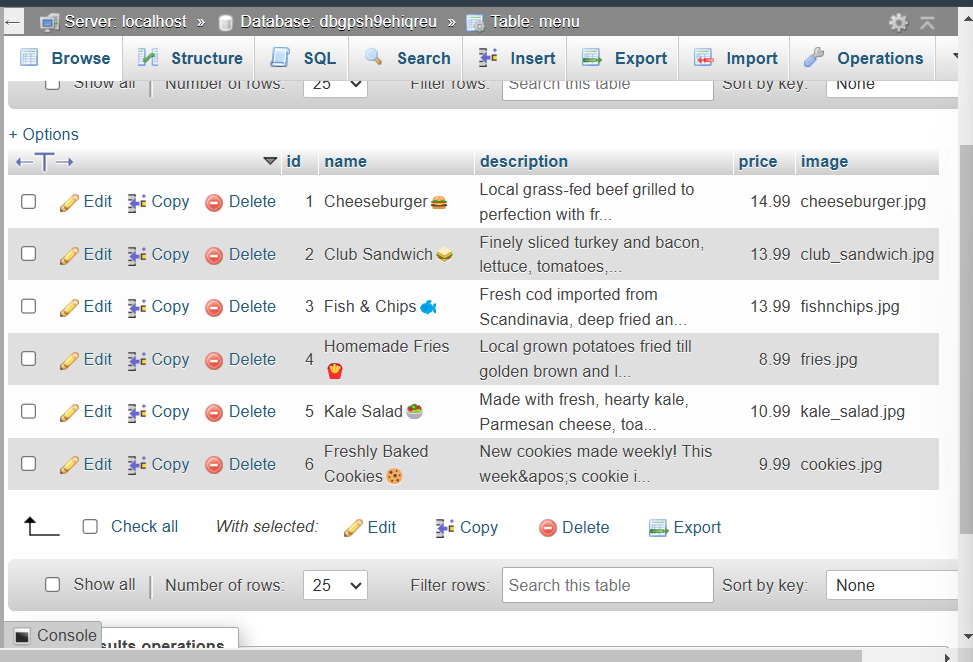

# Deliverable

1. Zipped code uploaded to Canvas
2. [URL of Order Form](https://johnp392.sg-host.com/HW12/order_form.php)
3. 

## Questions

1. What's the most satisfying part of this assignment?

I enjoyed all the different components of the project (i.e. php files, sql, js) interacting all together to create an order form. The project made me appreciate the complexity that goes into a seemingly simple task for everyday users.

2. How could you have used PHP to enhance your midterm project?

As we continue to refine our group project idea, I see how using php could be helpful in implementing the server-side functionality for dynamic content generation and data management. The code could also help me reuse certain components (i.e. headers, footers, menus, etc.).